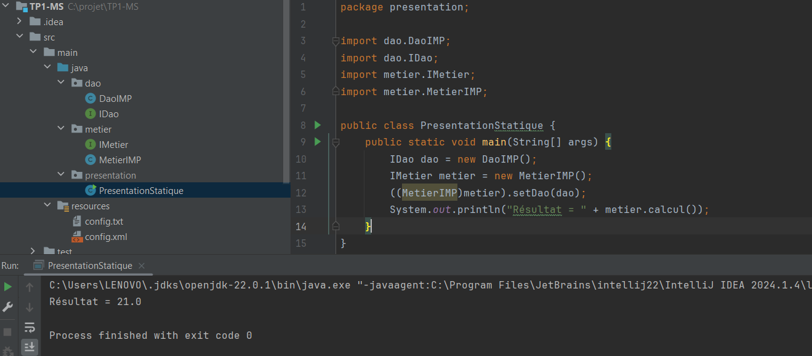

# TP1 - Inversion de Contrôle et Injection de Dépendances

## 1. Présentation du TP

Ce TP a pour objectif d'étudier le couplage faible,
l'injection de dépendances et le principe d'Inversion de Contrôle (IoC).

Nous avons réalisé quatre activités :

- Injection de dépendances par instanciation statique
- Injection de dépendances par instanciation dynamique
- Injection de dépendances avec Spring et XML
- Injection de dépendances avec Spring et annotations

# 2. Activité 1-1 : Injection de dépendances par instanciation statique

## Objectif

L'objectif de cette activité est de comprendre le concept
de couplage faible en utilisant l'injection de dépendances
par instanciation statique.

## Implémentation

Nous avons créé les interfaces IDao et IMetier ainsi que
les classes DaoIMP et MetierIMP.

La classe MetierIMP dépend de l'interface IDao et non
directement de la classe DaoIMP.

L'injection de dépendances est réalisée avec la méthode setDao().

## Résultat

Le programme retourne :

21.0
### Capture d'écran

